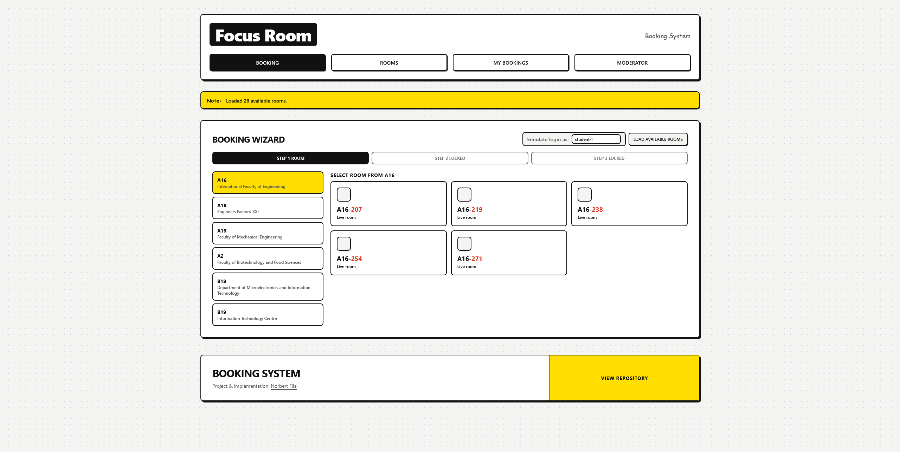
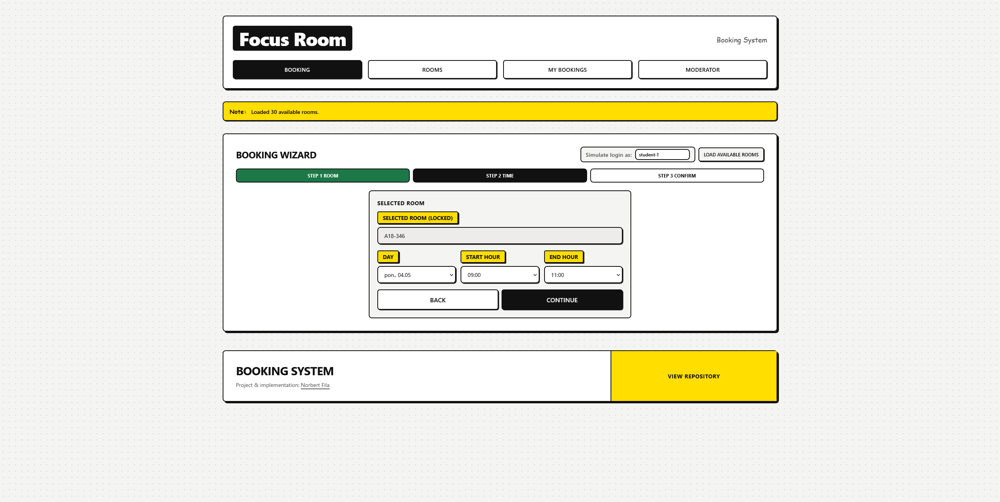
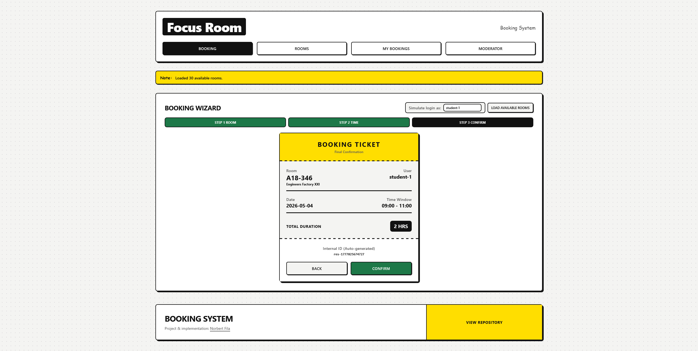
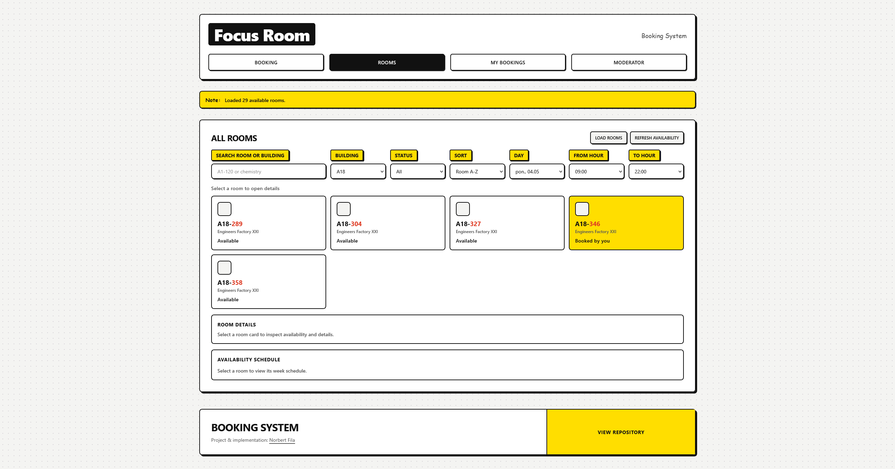
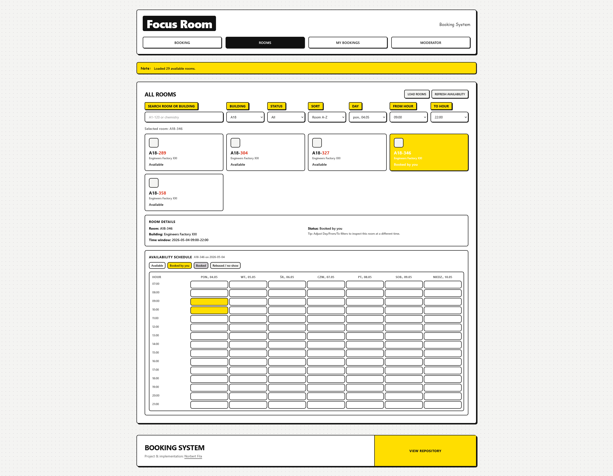
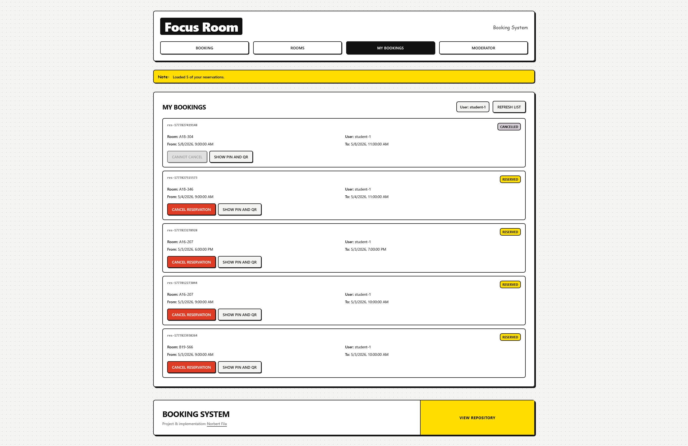
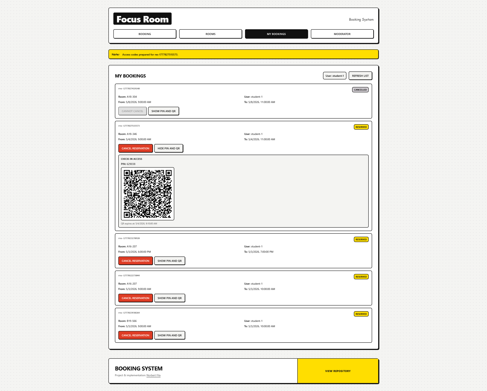
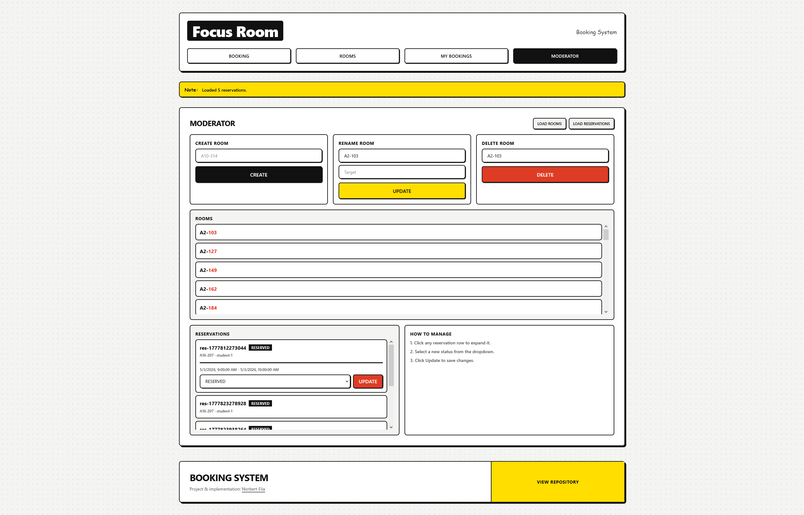

# Focus Study Room - Booking System

> **Academic Context:** This final project for the Software Engineering labs demonstrates the practical application of system design, UML modeling, TDD, and modern software architecture principles covered throughout the semester.

Web application for booking study rooms on a university campus.
App combines a searchable room explorer, a step-by-step booking wizard, and a moderator panel for managing campus infrastructure.

## What you get
- **Room Explorer**  
  Search rooms by code or building name, filter by availability, time window, and sort results.
- **Booking Wizard**  
  Intuitive 3-step process to select a room, choose a 24h time slot, and confirm with a virtual ticket.
- **Moderator Panel**  
  Create new rooms and rename existing ones to manage campus infrastructure.
- **Role Simulation**  
  Easily switch between User and Admin roles or simulate different accounts (e.g., `student-1`) without a auth setup.

## User roles
The app uses a simplified role-based flow for the prototype:
- **USER**: Can browse rooms, check availability, and make reservations.
- **ADMIN**: Can access the Moderator Panel to manage rooms.
Role and active user ID can be toggled directly in the UI.

## Tech stack
- **Frontend**: React + Vite + Tailwind CSS
- **Backend**: Node.js + Fastify + Prisma ORM
- **Language**: TypeScript

## Quick start

### Requirements
- Node.js `>=20`
- npm
- Docker Desktop (optional, only for Docker setup)

### 1) Environment variables (.env)
Before starting, create `backend/.env` based on `backend/.env.example`.

macOS/Linux:

```bash
cp backend/.env.example backend/.env
```

Windows (PowerShell):

```powershell
Copy-Item backend/.env.example backend/.env
```

Default value:

```env
DATABASE_URL="file:../dev.db"
```

This file is required for local backend startup (`npm run dev`).

### 2) Start backend

#### Option A: Docker (backend only)
```bash
cd devenv/compose
docker compose up --build
```

Backend API will be available on `http://localhost:3001`.

#### Option B: Local backend (no Docker)
```bash
cd backend
npm install
npm run dev
```

On startup, backend runs Prisma generate + schema push + seed automatically (`predev`).

### 3) Start frontend (local)
```bash
cd frontend
npm install
npm run dev
```

Then open `http://localhost:5173` in your browser.

## Troubleshooting
- **Missing `.env` / backend fails on startup**
  - Ensure `backend/.env` exists and contains `DATABASE_URL`.
  - Recreate from template: `cp backend/.env.example backend/.env`.

- **Database issues (local backend)**
  - Stop backend, delete `backend/dev.db`, then run `npm run dev` again in `backend`.
  - Schema and seed will be recreated automatically.

- **Docker backend data reset**
  - Stop containers and remove the volume (`backend_data`) if you need a clean DB state.

- **Ports already in use**
  - Ensure ports `3001` (Backend API) and `5173` (Frontend) are available.

- **Frontend cannot reach backend**
  - Confirm backend is running at `http://localhost:3001`.
  - Confirm frontend is running at `http://localhost:5173`.

## Data and persistence
- **Local backend**: on `npm run dev`, Prisma schema is pushed and seed is executed automatically.
- Local SQLite file is `backend/dev.db` (based on current `.env` template).
- Seed data includes campus buildings and generated rooms (`backend/prisma/seed.ts`).
- App changes (reservations, room updates) are persisted in SQLite.

- **Docker backend**: database is stored in Docker volume `backend_data` and survives container restarts.

## API notes
- The frontend fetches campus buildings from backend endpoint `GET /buildings`.
- Room availability is fetched from `GET /rooms/available`.
- Admin room management uses `GET/POST/PATCH/DELETE /admin/rooms`.
- Reservation moderation uses `GET /admin/reservations` and `PATCH /admin/reservations/{id}/status`.

## Screenshots

| Screen | Preview | Caption                                                                                                                                                           |
| --- | --- |-------------------------------------------------------------------------------------------------------------------------------------------------------------------|
| Booking Wizard - Step 1 |  | Select a building and room to start a new reservation.                                                                                                            |
| Booking Wizard - Step 2 |  | Choose date and time for the selected room.                                                                                                                       |
| Booking Wizard - Step 3 |  | Confirm reservation details before final booking.                                                                                                                 |
| Rooms Explorer |  | Search, filter, and sort rooms with availability status.                                                                                                          |
| Room Details Panel |  | Inspect selected room details and current booking window.                                                                                                         |
| My Bookings - List |  | View all reservations for the user account.                                                                                                                       |
| My Bookings - PIN and QR |  | Display PIN and QR access data for check-in.                                                                                                                      |
| Moderator Dashboard |  | Manage rooms and reservations from one admin panel: add, rename, and delete rooms, review all bookings, and update reservation statuses |


---
## Author
**Norbert Fila** 257185  
**IFE, Lodz University of Technology**


